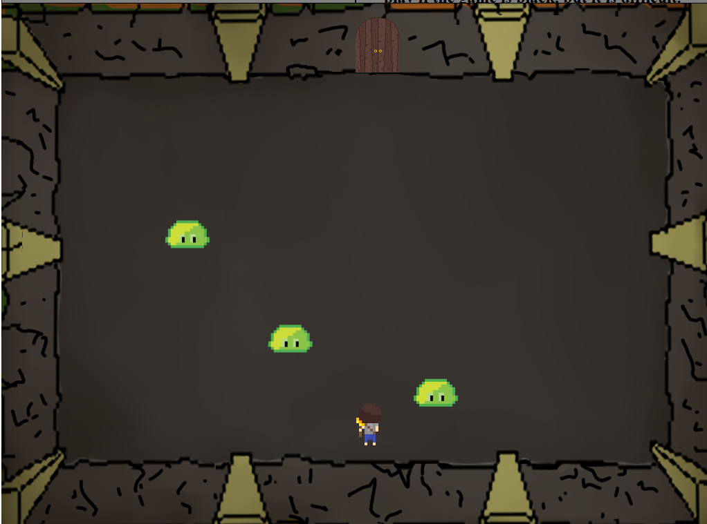

# The Depth Within



## Description
*The Depth Within* is a top-down combat and puzzle game built using HTML and JavaScript.  
Players must navigate a dangerous dungeon, solving puzzles and battling enemies while managing their health, represented by the brightness of the screen.

## Features
- **Diverse Challenges**: A variety of puzzle and combat rooms for engaging gameplay.
- **Dynamic Health System**: Health is visually represented by the screen's brightness, mimicking the light from the torch.
- **Immersive Experience**: Complementary effects and background music enhance the game environment.

## Technologies Used
- **Programming Languages**: HTML, JavaScript
- **Tools**: GarageBand, Adobe Illustrator, Photoshop

## Group Members
- Kevin Zhong  
- Chris Hirst  
- Ryan Huang  
- Jayden Paine  

## Installation and Setup
1. Clone this repository:
   ```bash
   git clone https://github.com/MoltoRubato/the_depth_within.git

2. Open index.html to play game
